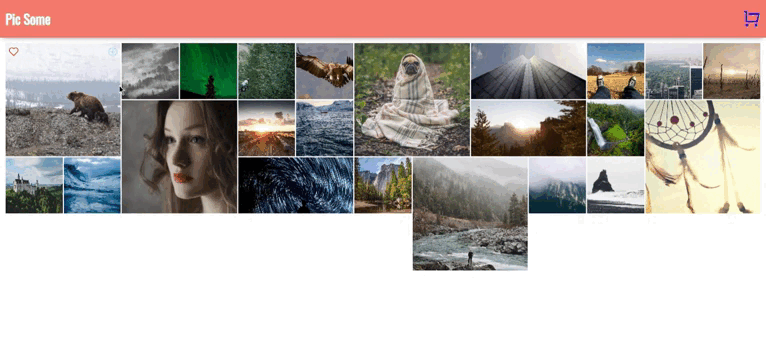

## Capstone Project: Photo Store
It is an eCommerce site that pulls all my new React knowledge together. You can access the random photos with the detail. I used the React context to provide and distribute photos. The photos is taken from the [Scrimba Images](https://raw.githubusercontent.com/bobziroll/scrimba-react-bootcamp-images/master/images.json). 
    
## Check The Live Website ➡️ [Live Website](https://fe-photo-store.netlify.app/)

```bash
- User can see the list of photos at the main page.
- User can toggle favorite pics
- User can see favorited pics
- User can add image to cart
- User can remove image from cart
- Total cost is automatically calculated
- User can place order
```
## Animation of the Website




## Technologies 💻
```bash
- React
- React Router Dom
- React Context
- Custom Hover Hook
- [Scrimba Images](https://raw.githubusercontent.com/bobziroll/scrimba-react-bootcamp-images/master/images.json)
```

Quick start:

```
$ yarn # npm install
$ yarn build # npm run build
````

## Development

Run Webpack in watch-mode to continually compile the JavaScript as you work:

```
$ yarn watch # npm run watch
```

## About Scrimba

At Scrimba our goal is to create the best possible coding school at the cost of a gym membership! 💜
If we succeed with this, it will give anyone who wants to become a software developer a realistic shot at succeeding, regardless of where they live and the size of their wallets 🎉
The Frontend Developer Career Path aims to teach you everything you need to become a Junior Developer, or you could take a deep-dive with one of our advanced courses 🚀

- [Our courses](https://scrimba.com/allcourses)
- [The Frontend Career Path](https://scrimba.com/learn/frontend)
- [Become a Scrimba Pro member](https://scrimba.com/pricing)

Happy Coding!
