## Table of contents

- [Overview](#overview)
- [1-class-components-challenges](#1-class-components-challenges)

  - [Challenge 1: Convert functional components to class components](#1-class-components-challenges/challenge-1)
  - [Challenge 2: Convert a class component with state](#1-class-components-challenges/challenge-2)
  - [Challenge 3: Constructor Method](#1-class-components-challenges/challenge-3)
  - [Challenge 4: Updating Complex State with this.setState()](#1-class-components-challenges/challenge-4)
  - [Challenge 5: Lifecycle Methods](#1-class-components-challenges/challenge-5)
  
- [2-code-reuse-in-react](#2-code-reuse-in-react)
  - [Challenge 1: React Children](#2-code-reuse-in-react/challenge-1)
  - [Challenge 2: Higher Order Components](#2-code-reuse-in-react/challenge-2)
  - [Challenge 3: Render Props](#2-code-reuse-in-react/challenge-3)
  
- [3-performance](#3-performance)
  - [Challenge 1: React.memo()](#3-performance/challenge-1)
  - [Challenge 2: shouldComponentUpdate()](#3-performance/challenge-2)
  - [Challenge 3: React.PureComponent](#3-performance/challenge-3)

- [4-react-context](#4-react-context)
  - [Challenge 1: Context Practice 1](#4-react-context/challenge-1)
  - [Challenge 2: Context Practice 2](#4-react-context/challenge-2)
  - [Challenge 3: Context Practice 3](#4-react-context/challenge-3)
  - [Challenge 4: Context Practice 4](#4-react-context/challenge-4)

- [5-react-hooks](#5-react-hooks)
  - [Challenge 1: Speed Typing Game Part 1](#5-react-hooks/challenge-1)
  - [Challenge 2: Speed Typing Game Part 2](#5-react-hooks/challenge-2)
  - [Challenge 3: Refactor "Challenge 3 on 4-react-context" ](#5-react-hooks/challenge-3)

  ## Overview

  Completed these challenges that are parts of [Scrimba](https://scrimba.com/learn/frontend/)'s Advanced React Course. I learned fundamentals of advanced React topics with these challenges.
  You can see the visual representations of the each app below.

  ## 1-class-components-challenges
     These challenges include class components and lifecycle methods.

  ### Challenge 1: Convert functional components to class components

  ### Visualization of the app;

  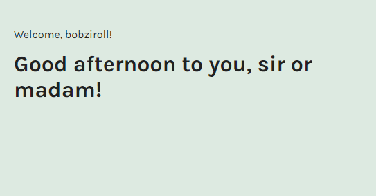

  ### Challenge 2: Convert a class component with state

  ### Visualization of the app;

  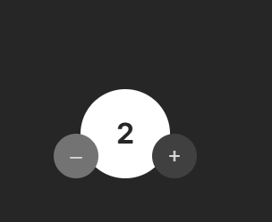

  ### Challenge 3: Constructor Method

  ### Description: Added constructor method on Challenge 2 practice above

  ### Visualization of the app;

  
  
  ### Challenge 4: Updating Complex State with this.setState()

  ### Visualization of the app;

  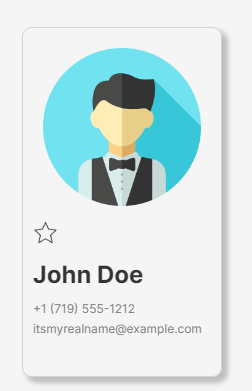
  
    
  ### Challenge 5: Lifecycle Methods

  ### Visualization of the app;

  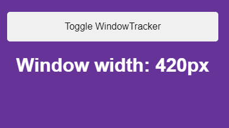
  
  
 
  ## 2-code-reuse-in-react
     These challenges include code reuse in React

  ### Challenge 1: React Children

  ### Visualization of the app;

  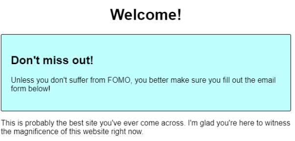
  
  ### Challenge 2: Higher Order Components

  Writing a higher-order component that passes a new prop to the given componentcalled "favoriteNumber" and includes a favorite number. Then, in App.js, rendered that favorite number to the screen. It is written just 42.
  
  ### Challenge 3: Render Props

  ### Visualization of the app;

  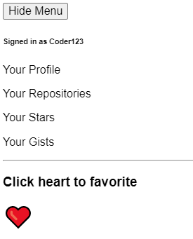
  
  
   
  ## 3-performance
     These challenges include performance optimization methods in React

  ### Challenge 1: React.memo()

  ### Visualization of the app;

  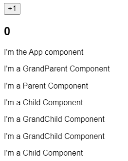

  ### Challenge 2: shouldComponentUpdate()
  Implied performance optimization with shouldComponentUpdate() on the same project on Challenge 1 
  
  ### Challenge 3: React.PureComponent
  Implied performance optimization with React.PureComponent on the same project on Challenge 2
  
  
  ## 4-react-context
     These challenges include react context practices in React

  ### Challenge 1: Context Practice with createContext() and contextType

  ### Visualization of the app;

  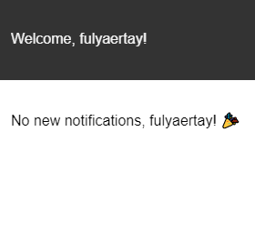

  ### Challenge 2: Context.Consumer
  Converted functional components and used <UserContext.Consumer> for the above practice
  
  
  ### Challenge 3: Changing Context

  ### Visualization of the app;

  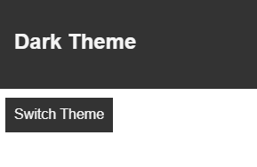
  
    
  ### Challenge 4: Adding form
  Changing userContext into a component that has state and providing the ability to change the user's username on Challenge 3

  ### Visualization of the app;

  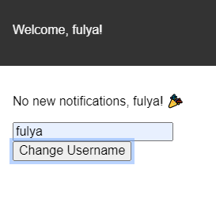
  
  
  ## 5-react-hooks
     These challenges include react hooks practices in React

  ### Challenge 1: Speed Typing Game Part 1
  useState(), useEffect() hooks are used in this project

  ### Visualization of the app;

  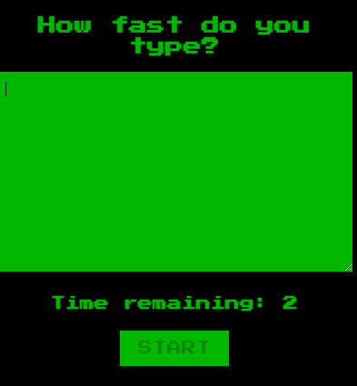
  
  ### Challenge 2: Speed Typing Game Part 2
  useRef() hook added to focus textarea on Challenge 2 
  
  
  ### Challenge 3: Refactor "Challenge 3 on 4-react-context" 
  Adding useContext() hook added to Challenge 3 on 4-react-context

