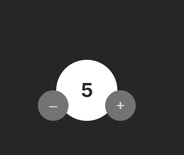

**## Table of contents**

- [Overview](#overview)
- [1-class-components-challenges](#1-class-components-challenges)

  - [Challenge 1: Convert functional components to class components](#1-class-components-challenges/challenge-1)
  - [Challenge 2: Convert a class component with state](#1-class-components-challenges/challenge-2)
  - [Challenge 3: Constructor Method](#1-class-components-challenges/challenge-3)
  - [Challenge 4: Updating Complex State with this.setState()](#1-class-components-challenges/challenge-4)

  ## Overview

  Completed these challenges that are parts of [Scrimba](https://scrimba.com/learn/frontend/)'s Advanced React Course. I learned fundamentals of advanced React topics with these challenges.
  You can see the visual representations of the each app below.

  ## 1-class-components-challenges

  ### Challenge 1: Convert functional components to class components

  ### Visualization of the app;

  

  ### Challenge 2: Convert a class component with state

  ### Visualization of the app;

  

  ### Challenge 3: Constructor Method

  ### Description: Added constructor method on Challenge 2 practice above

  ### Visualization of the app;

  
  
  ### Challenge 4: Updating Complex State with this.setState()

  ### Visualization of the app;

  
